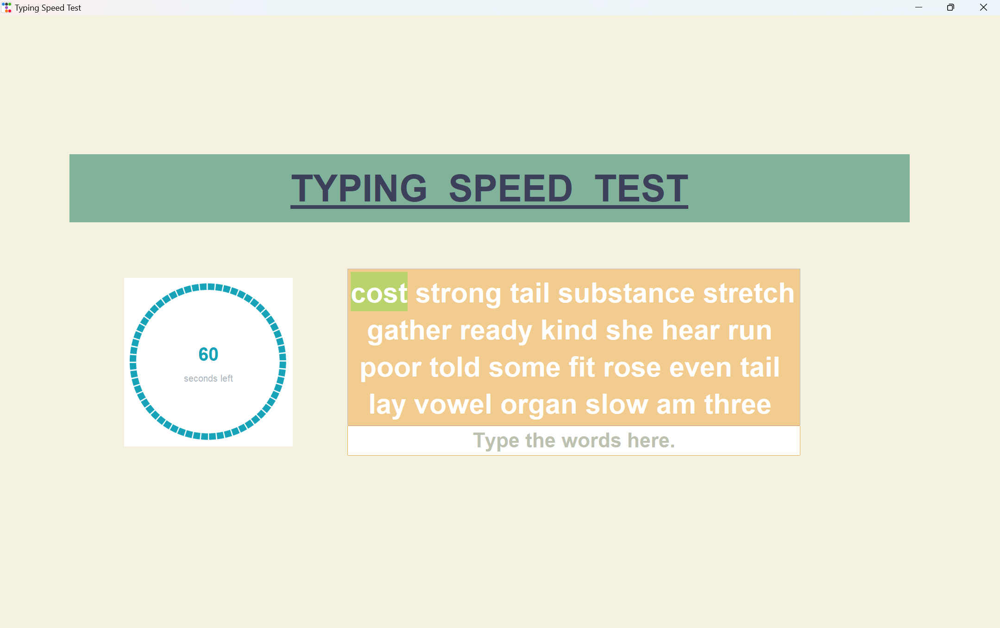
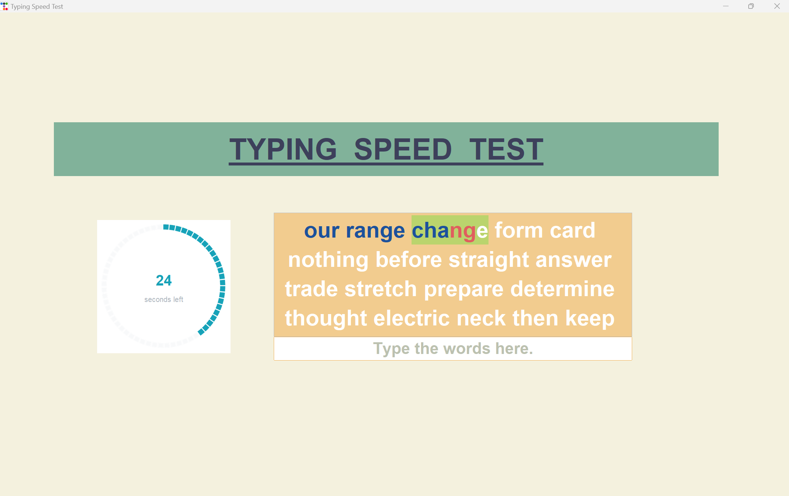
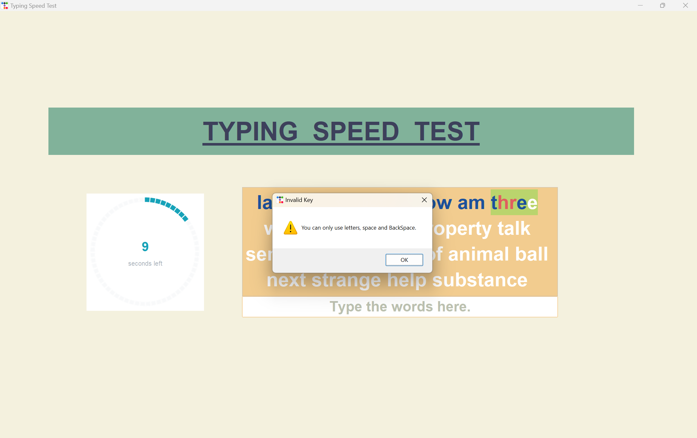
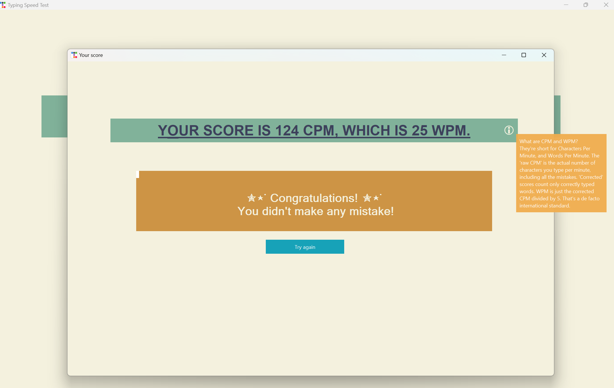
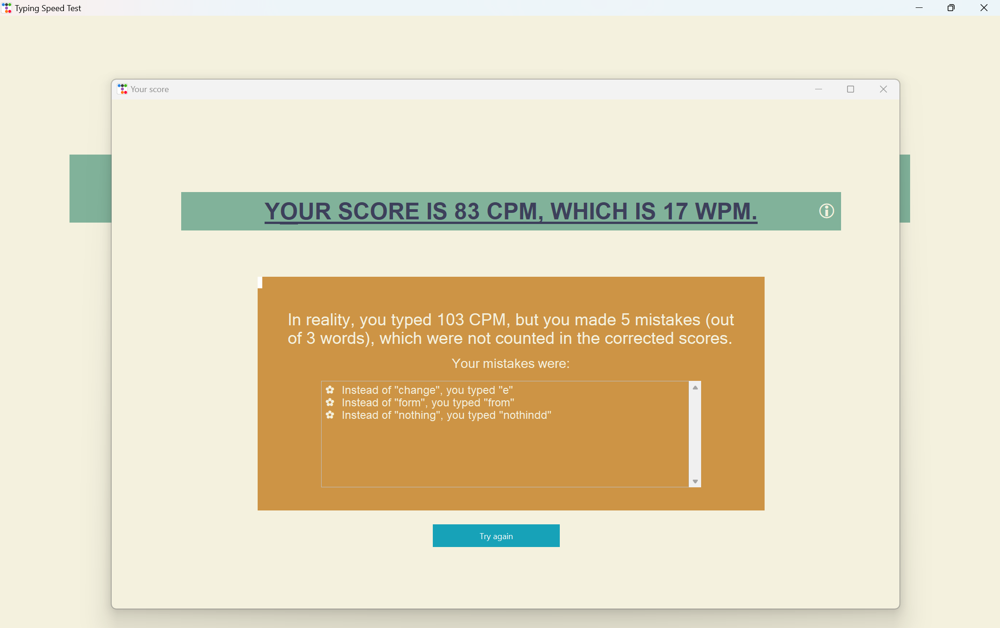

# Typing Speed Test App


## Description
Speed Typing Test is a desktop application written in Python that allows users to check their typing speed on the keyboard. The application measures the time for 60 seconds, calculates the typing speed in characters per minute (CPM) and words per minute (WPM), and also displays words with typing errors.

## Features
- Measurement of typing speed in WPM and CPM
- Checking the correctness of typed words
- Displaying words with errors at the end of the test
- Using tkinter and ttkbootstrap for a user-friendly interface

## System Requirements
- Operating System: Windows, macOS, Linux
- Python 3.7 or higher
- Installed libraries: tkinter, ttkbootstrap

## Installation
### Windows/macOS/Linux
1. Clone the repository:
```bash 
git clone https://github.com/toster3d/Typing-Speed-Test.git
```
```bash
cd Typing-Speed-Test
```

2. Install the required packages:

```bash
pip install -r requirements.txt
```

# Usage
1. Launch the application.
2. A list of randomly selected words from the 1000 most commonly used English words will be displayed.
3. The timer starts automatically when you begin typing the first letter.


4. As you type:
- Correctly typed letters will be highlighted in blue.
- Incorrectly typed letters will be highlighted in red.
- The currently typed word will be highlighted in green.
- You can correct errors in the current word using the backspace key, but you cannot go back to previous words.



5. After 60 seconds, the program will end the test and display a new window with your results:
- Typing speed in CPM and WPM
- List of words with errors




## Issues and Contributions
If you encounter any issues or have suggestions for improvements, feel free to open an issue or create a pull request.

Enjoy!
## Author
Jagoda Spychala
